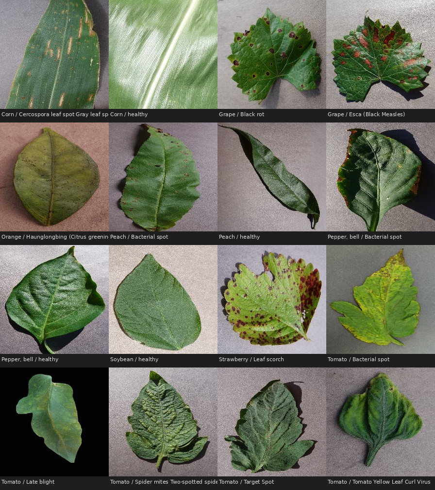
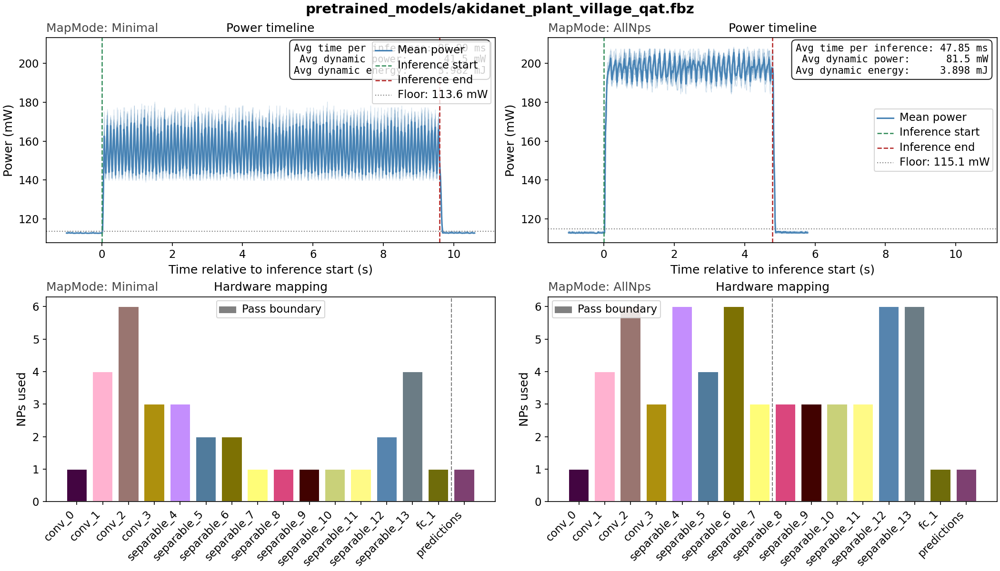
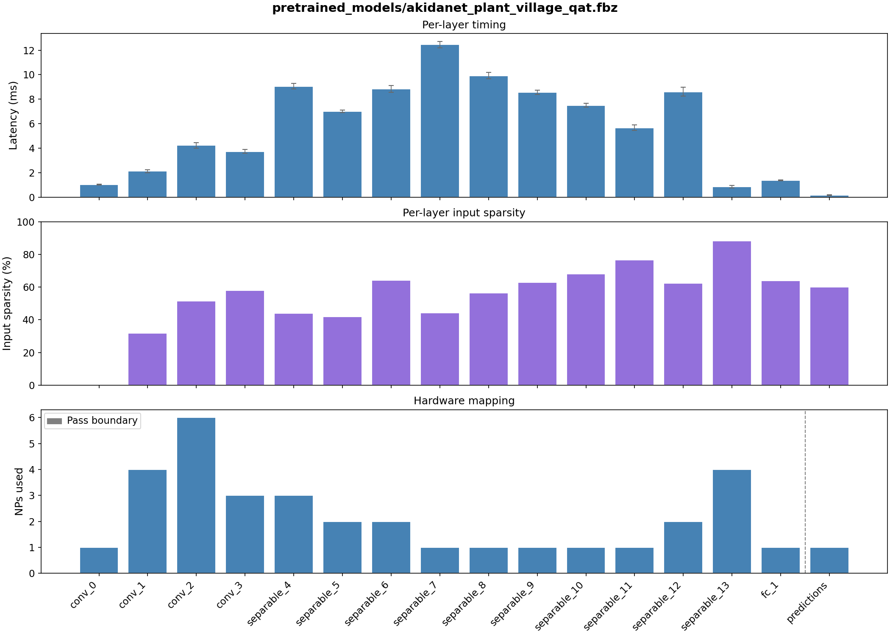

# PlantVillage Disease Classification


## Dataset

The **PlantVillage** dataset contains 54,303 images of healthy and diseased
plant leaves, divided into **38 categories** by plant species and disease type.
It is a widely-used benchmark for agricultural AI research and edge deployment.

Images cover 14 crop species (including tomato, potato, corn, grape, apple and
others) and up to 26 distinct diseases, plus healthy variants. All images are
RGB photographs of individual leaves against a uniform background, originally
at variable resolutions. For this example they are resized to **224 × 224 RGB**.

The dataset is loaded via TensorFlow Datasets (`plant_village`). It is split as:
- **Train**: 80 % of the full dataset (~43,442 images)
- **Validation**: next 10 % (~5,430 images)
- **Test** (held out): final 10 % (~5,431 images)



*16 randomly selected samples from the 38-class dataset, illustrating the variety of plant species and disease types.*

Original dataset licensed under CC0 1.0 (public domain):
> J, ARUN PANDIAN; GOPAL, GEETHARAMANI (2019), *"Data for: Identification of
> Plant Leaf Diseases Using a 9-layer Deep Convolutional Neural Network"*,
> Mendeley Data, V1, doi: 10.17632/tywbtsjrjv.1

## Model

<table>
  <thead>
    <tr>
      <th>Float acc.</th>
      <th>QAT acc.</th>
      <th>Akida acc.</th>
      <th>Sparsity</th>
      <th>Params</th>
    </tr>
  </thead>
  <tbody>
    <tr>
      <td align="center">99.61%</td>
      <td align="center">99.43%</td>
      <td align="center">99.43%</td>
      <td align="center">54.58%</td>
      <td align="center">1,156,054</td>
    </tr>
  </tbody>
</table>

**AKD1500 hardware benchmark**

<table>
  <thead>
    <tr>
      <th>Mapping</th>
      <th>NPs</th>
      <th>Passes</th>
      <th>Cycles</th>
      <th>Latency (ms)</th>
      <th>Total Power (mW)</th>
      <th>Total Energy (mJ/inf)</th>
      <th>Dyn. Power (mW)</th>
      <th>Dyn. Energy (mJ/inf)</th>
    </tr>
  </thead>
  <tbody>
    <tr>
      <td>Minimal</td>
      <td align="center">34</td>
      <td align="center">2</td>
      <td align="center">36418191</td>
      <td align="center">91.045</td>
      <td align="center">155.1</td>
      <td align="center">14.878</td>
      <td align="center">41.5</td>
      <td align="center">3.982</td>
    </tr>
    <tr>
      <td>AllNPs</td>
      <td align="center">59</td>
      <td align="center">2</td>
      <td align="center">18310973</td>
      <td align="center">45.777</td>
      <td align="center">196.5</td>
      <td align="center">9.404</td>
      <td align="center">81.5</td>
      <td align="center">3.898</td>
    </tr>
  </tbody>
</table>



The plot above shows power measurements captured during inference on hardware.
In **Minimal** mapping the model is scheduled onto the fewest NPs required,
keeping power consumption low. Switching to **AllNps** spreads the model across
more NPs, which results in a slight increase in power during inference but a
proportional reduction in latency.

The model is a standard **AkidaNet** (from `akida_models`) with
width multiplier **alpha = 0.5** and input resolution **224 × 224**.
The 38-class classification head replaces the ImageNet top layers.
Input scaling `(128, -1)` is included in the model so the pipeline delivers
raw uint8 pixel values with no additional normalisation.



## Pipeline

Training follows a three-stage quantization pipeline, followed
by conversion to Akida format:

| Stage | Description |
|---|---|
| Full-precision | Float32 training from scratch, 50 epochs |
| Post-training quantization | `cnn2snn quantize` reduces to 8-bit weights and activations (8-bit input) |
| Quantization-aware tuning | 2 epochs fine-tuning of the quantized model to recover accuracy |
| Conversion to Akida | Automated conversion to Akida model format |

## Requirements
This example generated and tested under
```
tensorflow[and-cuda]==2.19.1
tf_keras==2.19.0
akida==2.19.1
quantizeml==1.2.3
cnn2snn==2.19.1
akida_models==1.14.0
tensorflow_datasets>=4.9.0

ipykernel
pooch
```

The hardware benchmarking (`plant_village_benchmark.py` and step 9 in the notebook) and results plotting steps
additionally require the `brainchip_utils` package from this repository. Install it into
your environment from the repo root:

```bash
pip install -v -e .
```

## Dataset setup

The PlantVillage dataset is downloaded automatically via TensorFlow Datasets
on the first training or evaluation run. The dataset will be stored at the
path you provide with `--data` (default: `./data/plant_village`).

To pre-download the dataset without running training:

```bash
python -c "import tensorflow_datasets as tfds; tfds.load('plant_village', data_dir='./data/plant_village')"
```

If you want to store the dataset on a dedicated data drive, pass the path
explicitly to each script (see `--data` / `-d` in the individual scripts).
Alternatively, create a symbolic link from the default path (one-off step):

```bash
mkdir /path/to/your/data/plant_village
ln -s /path/to/your/data/plant_village ./data/plant_village
```

This way the scripts work out of the box without any extra arguments.

## Usage

### Notebook

[plant_village_notebook.ipynb](plant_village_notebook.ipynb) walks through the complete training
pipeline end-to-end. It is written to expose and explain the Akida-specific
aspects of the workflow: how the model is constructed for Akida compatibility,
what the quantization constraints mean in practice, and what the conversion
step does. Start here if you want to understand *why* the pipeline is structured
the way it is.

### Script

For straightforward reproduction of the training and evaluation results, run
the full pipeline in one shot:

```bash
bash plant_village_train.sh [DATADIR]
```

The optional `DATADIR` argument overrides the default dataset location
(`./data/plant_village`).

The script executes the following steps in order. This will take from
1-2 hours to run if a modern GPU is available, almost all of which is
the 50 epochs of initial training.

**1. Build the model**
```bash
python plant_village_model.py -s models/akidanet_plant_village_untrained.h5
```
Instantiates AkidaNet (alpha = 0.5, 224 × 224 input, 38 classes) and saves the untrained
weights.

**2. Float training**
```bash
python plant_village_train.py -l models/akidanet_plant_village_untrained.h5 \
                              -s models/akidanet_plant_village.h5 \
                              -e 50 -lr 1e-2
```
Trains from scratch for 50 epochs in full precision (Float32) with exponential
LR decay from 1e-2 to 1e-4.

**3. Float evaluation**
```bash
python plant_village_eval.py -l models/akidanet_plant_village.h5
```
Reports validation accuracy of the float model.

**4. Post-training quantization**
```bash
cnn2snn quantize -m models/akidanet_plant_village.h5 -i 8 -w 8 -a 8
```
Quantizes the model to 8-bit inputs, 8-bit weights, and 8-bit activations,
producing `akidanet_plant_village_iq8_wq8_aq8.h5`.

**5. Quantization-aware tuning (QAT)**
```bash
python plant_village_train.py -l models/akidanet_plant_village_iq8_wq8_aq8.h5 \
                              -s models/akidanet_plant_village_qat.h5 \
                              -lr 1e-4 -e 2
```
Fine-tunes the quantized model for 2 epochs at a lower learning rate to
recover accuracy lost during quantization.

**6. Quantized evaluation**
```bash
python plant_village_eval.py -l models/akidanet_plant_village_qat.h5
```
Reports validation accuracy of the quantized model.

**7. Conversion to Akida format**
```bash
cnn2snn convert -m models/akidanet_plant_village_qat.h5
```
Converts the quantized Keras model to the Akida `.fbz` format ready for
on-chip deployment.

**8. Akida evaluation**
```bash
python plant_village_eval.py -l models/akidanet_plant_village_qat.fbz
```
Reports validation accuracy running inference through the Akida model,
confirming parity with the quantized Keras result. This evaluation step
is done using an Akida 1 hardware device if one is connected. Otherwise
it will fall back to using the Akida software backend.

**9. Akida benchmark**
```bash
python plant_village_benchmark.py -l models/akidanet_plant_village_qat.fbz
```
This will only run if an Akida 1 hardware device is connected. It benchmarks
the inference latency across a large number of samples (but at batch-size=1)
and if power measurement is available on the machine, records total and
dynamic power consumption, and energy per inference. These benchmarks are run
in both `Minimal` and `AllNps` mapping modes.

Following this, a second set of benchmarks are run (in `Minimal` mapping mode)
which break down the latency per layer. The activation sparsity per layer is
also recorded.

Benchmark results are recorded in two plots, `benchmark_results_full.png` and
`benchmark_results_layers.png`.

## Contributing and Maintenance

This README is autogenerated from `docs/README.md.template`
so that the accuracy and hardware benchmark values are written directly
by the code (via the `metrics.json` file, also in the docs folder).

When the associated model or training pipeline is modified to improve
performance, you should rerun the evaluations of the float, quantized
and Akida model versions, plus the hardware benchmark, including the
`--save-metrics` argument, and then regenerate the README from the template
using `update_readme.py`:
```bash
python plant_village_eval.py -l models/akidanet_plant_village.h5 --save-metrics
python plant_village_eval.py -l models/akidanet_plant_village_qat.h5 --save-metrics
python plant_village_eval.py -l models/akidanet_plant_village_qat.fbz --save-metrics
python plant_village_benchmark.py -l models/akidanet_plant_village_qat.fbz --save-metrics
python update_readme.py
```
Then commit the changed files (template, metrics and updated README).

Likewise, if you want to edit the contents of this README, you should
not edit it directly, but instead edit `docs/README.md.template` and
then regenerate the README using
``` bash
python update_readme.py
```
