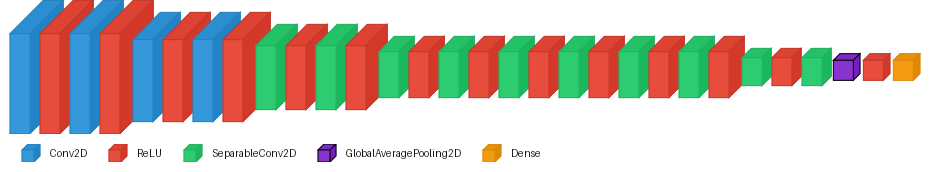

# Visual Wake Words (VWW)


## Dataset


Visual Wake Words is a binary image classification benchmark, specifically
designed to target edge deployment on resource-constrained devices. It is 
derived from the MS-COCO 2014 dataset. Each image is labelled **person** 
or **non-person** based on whether a person occupies at least 2% of the frame.
Images are resized to **96 × 96 RGB**. The dataset contains approximately 
115k training images and 8k validation images.

Reference: Chowdhery et al., *Visual Wake Words Dataset* (2019),
[arXiv:1906.05721](https://arxiv.org/abs/1906.05721).

## Model

<table>
  <thead>
    <tr>
      <th colspan="6">Model performance</th>
      <th colspan="4">AKD1500 hardware benchmark</th>
    </tr>
    <tr>
      <th>Float acc.</th>
      <th>QAT acc.</th>
      <th>Akida acc.</th>
      <th>Sparsity</th>
      <th>Params</th>
      <th>Size (KB)</th>
      <th colspan="2">Minimal mapping</th>
      <th colspan="2">AllNPs mapping</th>
    </tr>
    <tr>
      <th></th><th></th><th></th><th></th><th></th><th></th>
      <th>Cycles</th><th>Latency</th>
      <th>Cycles</th><th>Latency</th>
    </tr>
  </thead>
  <tbody>
    <tr>
      <td align="center">87.01%</td>
      <td align="center">84.65%</td>
      <td align="center">84.68%</td>
      <td align="center">72.35%</td>
      <td align="center">226,906</td>
      <td align="center">—</td>
      <td align="center">—</td><td align="center">—</td>
      <td align="center">—</td><td align="center">—</td>
    </tr>
  </tbody>
</table>

The model is a standard **Akidanet** (from `akida_models`) with
width multiplier **alpha = 0.25** and input resolution **96 × 96**.



## Pipeline

Training follows a three-stage quantisation pipeline, followed
by conversion to Akida format:

| Stage | Description |
|---|---|
| Full-precision | Float32 training from scratch, 50 epochs |
| Post-training quantisation | `cnn2snn quantize` reduces to 4-bit weights and activations (8-bit input) |
| Quantisation-aware tuning | 2 epochs fine-tuning of the quantised model to recover accuracy |
| Conversion to Akida | Automated conversion to Akida model format |

## Requirements
This example generated and tested under
```
tensorflow[and-cuda]==2.19.1
tf_keras==2.19.0
akida==2.19.1
quantizeml==1.2.3
cnn2snn==2.19.1
akida_models==1.14.0

ipykernel==7.3.0
pooch==1.9.0
```

## Dataset setup

The dataset can be downloaded from the SiLabs ML benchmarks mirror:

```bash
wget https://www.silabs.com/public/files/github/machine_learning/benchmarks/datasets/vw_coco2014_96.tar.gz
tar -xzf vw_coco2014_96.tar.gz
```

The scripts default to looking for the data at `./data/vw_coco2014_96`. If you
want to store the dataset on a dedicated data drive, you can pass the path
explicitly to each script (see `--data` / `-d` in the individual scripts).
Alternatively, it may be more convenient to keep the dataset in its preferred
location and create a symbolic link from the default path (one-off step):

```bash
ln -s /path/to/your/data/vw_coco2014_96 ./data/vw_coco2014_96
```

This way the scripts work out of the box without any extra arguments.

## Usage

### Notebook

[vww_notebook.ipynb](vww_notebook.ipynb) walks through the complete training
pipeline end-to-end. It is written to expose and explain the Akida-specific
aspects of the workflow: how the model is constructed for Akida compatibility,
what the quantisation constraints mean in practice, and what the conversion
step does. Start here if you want to understand *why* the pipeline is structured
the way it is.

### Script

For straightforward reproduction of the training and evaluation results, run
the full pipeline in one shot:

```bash
bash vww_train.sh [DATADIR]
```

The optional `DATADIR` argument overrides the default dataset location
(`./data/vw_coco2014_96`).

The script executes the following steps in order:

**1. Build the model**
```bash
python vww_model.py -s models/akidanet_vww_untrained.h5
```
Instantiates AkidaNet (alpha = 0.25, 96 × 96 input) and saves the untrained
weights.

**2. Float training**
```bash
python vww_train.py -l models/akidanet_vww_untrained.h5 \
                    -s models/akidanet_vww.h5 \
                    -e 50 -lr 1e-3
```
Trains from scratch for 50 epochs in full precision (Float32).

**3. Float evaluation**
```bash
python vww_eval.py -l models/akidanet_vww.h5
```
Reports validation accuracy of the float model.

**4. Post-training quantisation**
```bash
cnn2snn quantize -m models/akidanet_vww.h5 -i 8 -w 4 -a 4
```
Quantises the model to 8-bit inputs, 4-bit weights, and 4-bit activations,
producing `akidanet_vww_iq8_wq4_aq4.h5`.

**5. Quantisation-aware tuning (QAT)**
```bash
python vww_train.py -l models/akidanet_vww_iq8_wq4_aq4.h5 \
                    -s models/akidanet_vww_qat.h5 \
                    -lr 1e-4 -e 2
```
Fine-tunes the quantised model for 2 epochs at a lower learning rate to
recover accuracy lost during quantisation.

**6. Quantised evaluation**
```bash
python vww_eval.py -l models/akidanet_vww_qat.h5
```
Reports validation accuracy of the quantised model.

**7. Conversion to Akida format**
```bash
cnn2snn convert -m models/akidanet_vww_qat.h5
```
Converts the quantised Keras model to the Akida `.fbz` format ready for
on-chip deployment.

**8. Akida evaluation**
```bash
python vww_eval.py -l models/akidanet_vww_qat.fbz
```
Reports validation accuracy running inference through the Akida model,
confirming parity with the quantised Keras result. This evaluation step
is done using the Akida software backend, that is, you can check the 
final accuracy of an Akida model without the need for access to a hardware
device.
