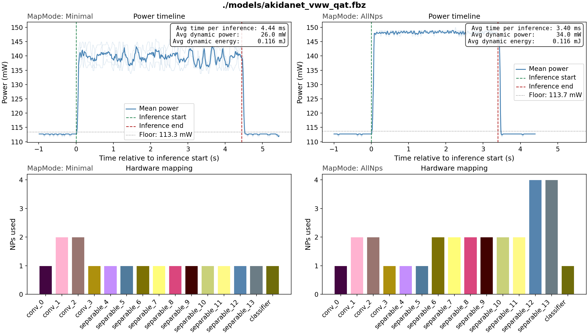
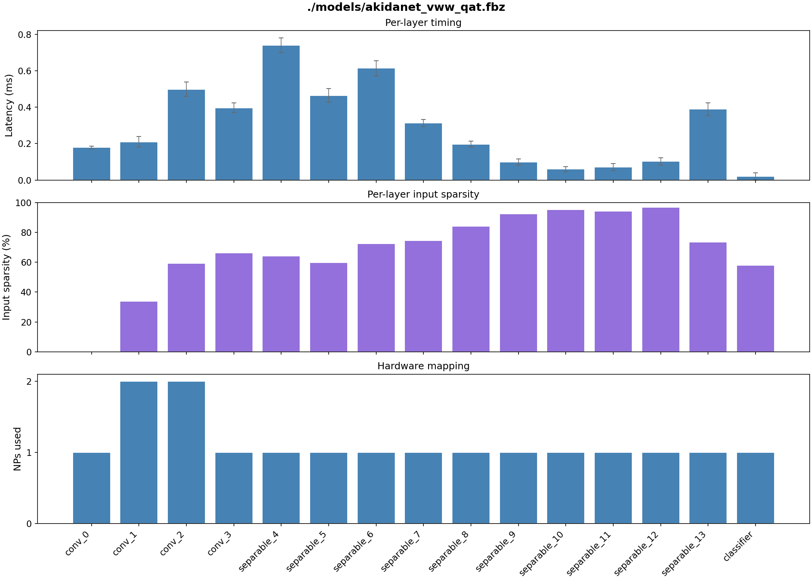

# Visual Wake Words (VWW)


## Dataset


Visual Wake Words is a binary image classification benchmark, specifically
designed to target edge deployment on resource-constrained devices. It is
derived from the MS-COCO 2014 dataset. Each image is labelled **person**
or **non-person** based on whether a person occupies at least 2% of the frame.
Images are resized to **96 × 96 RGB**. The dataset contains approximately
115k training images and 8k validation images.

Reference: Chowdhery et al., *Visual Wake Words Dataset* (2019),
[arXiv:1906.05721](https://arxiv.org/abs/1906.05721).

## Model

<table>
  <thead>
    <tr>
      <th>Float acc.</th>
      <th>QAT acc.</th>
      <th>Akida acc.</th>
      <th>Sparsity</th>
      <th>Params</th>
    </tr>
  </thead>
  <tbody>
    <tr>
      <td align="center">87.01%</td>
      <td align="center">84.65%</td>
      <td align="center">84.68%</td>
      <td align="center">68.29%</td>
      <td align="center">226,906</td>
    </tr>
  </tbody>
</table>

**AKD1500 hardware benchmark**

<table>
  <thead>
    <tr>
      <th>Mapping</th>
      <th>NPs</th>
      <th>Passes</th>
      <th>Cycles</th>
      <th>Latency (ms)</th>
      <th>Total Power (mW)</th>
      <th>Total Energy (mJ/inf)</th>
      <th>Dyn. Power (mW)</th>
      <th>Dyn. Energy (mJ/inf)</th>
    </tr>
  </thead>
  <tbody>
    <tr>
      <td>Minimal</td>
      <td align="center">17</td>
      <td align="center">1</td>
      <td align="center">1743040</td>
      <td align="center">4.358</td>
      <td align="center">139.3</td>
      <td align="center">0.619</td>
      <td align="center">26.0</td>
      <td align="center">0.116</td>
    </tr>
    <tr>
      <td>AllNPs</td>
      <td align="center">29</td>
      <td align="center">1</td>
      <td align="center">1325867</td>
      <td align="center">3.315</td>
      <td align="center">147.7</td>
      <td align="center">0.502</td>
      <td align="center">34.0</td>
      <td align="center">0.116</td>
    </tr>
  </tbody>
</table>



The plot above shows power measurements captured during inference on hardware.
In **Minimal** mapping the model is scheduled onto the fewest NPs required,
keeping power consumption low. Switching to **AllNps** spreads the model across
more NPs (visible in the lower trace plots), which results in a slight increase
in power during inference but a proportional reduction in latency.

The model is a standard **Akidanet** (from `akida_models`) with
width multiplier **alpha = 0.25** and input resolution **96 × 96**.


Latency can also be profiled on a per-layer basis, making it possible to see
which layers dominate processing time. This is determined by several factors:
the volume of inputs to the layer and its number of filters, the type of layer
and kernel size, and the number of NPs the layer is spread over. On Akida,
input activation sparsity is another strong determinant — layers where input
sparsity is particularly high take very little processing time.



## Pipeline

Training follows a three-stage quantization pipeline, followed
by conversion to Akida format:

| Stage | Description |
|---|---|
| Full-precision | Float32 training from scratch, 50 epochs |
| Post-training quantization | `cnn2snn quantize` reduces to 4-bit weights and activations (8-bit input) |
| Quantization-aware tuning | 2 epochs fine-tuning of the quantized model to recover accuracy |
| Conversion to Akida | Automated conversion to Akida model format |

## Requirements
This example generated and tested under
```
tensorflow[and-cuda]==2.19.1
tf_keras==2.19.0
akida==2.19.1
quantizeml==1.2.3
cnn2snn==2.19.1
akida_models==1.14.0

ipykernel
pooch
```

The hardware benchmarking (`vww_benchmark.py` and step 9 in the notebook) and results plotting steps 
additionally require the `brainchip_utils` package from this repository. Install it into
your environment from the repo root:

```bash
pip install -v -e .
```

## Dataset setup

The dataset can be downloaded from the SiLabs ML benchmarks mirror:

```bash
wget https://www.silabs.com/public/files/github/machine_learning/benchmarks/datasets/vw_coco2014_96.tar.gz
tar -xzf vw_coco2014_96.tar.gz
```

The scripts default to looking for the data at `./data/vw_coco2014_96`. If you
want to store the dataset on a dedicated data drive, you can pass the path
explicitly to each script (see `--data` / `-d` in the individual scripts).
Alternatively, it may be more convenient to keep the dataset in its preferred
location and create a symbolic link from the default path (one-off step):

```bash
ln -s /path/to/your/data/vw_coco2014_96 ./data/vw_coco2014_96
```

This way the scripts work out of the box without any extra arguments.

## Usage

### Notebook

[vww_notebook.ipynb](vww_notebook.ipynb) walks through the complete training
pipeline end-to-end. It is written to expose and explain the Akida-specific
aspects of the workflow: how the model is constructed for Akida compatibility,
what the quantization constraints mean in practice, and what the conversion
step does. Start here if you want to understand *why* the pipeline is structured
the way it is.

### Script

For straightforward reproduction of the training and evaluation results, run
the full pipeline in one shot:

```bash
bash vww_train.sh [DATADIR]
```

The optional `DATADIR` argument overrides the default dataset location
(`./data/vw_coco2014_96`).

The script executes the following steps in order. This will take from 
1-2 hours to run if a modern GPU is available, almost all of which is
the 50 epochs of initial training. If you want to save time and focus on
the Akida-evaluation steps only, you can skip directly to step 5b, 
which downloads a pretrained, quantized model directly from the BrainChip
servers:

**1. Build the model**
```bash
python vww_model.py -s models/akidanet_vww_untrained.h5
```
Instantiates AkidaNet (alpha = 0.25, 96 × 96 input) and saves the untrained
weights.

**2. Float training**
```bash
python vww_train.py -l models/akidanet_vww_untrained.h5 \
                    -s models/akidanet_vww.h5 \
                    -e 50 -lr 1e-3
```
Trains from scratch for 50 epochs in full precision (Float32).

**3. Float evaluation**
```bash
python vww_eval.py -l models/akidanet_vww.h5
```
Reports validation accuracy of the float model.

**4. Post-training quantization**
```bash
cnn2snn quantize -m models/akidanet_vww.h5 -i 8 -w 4 -a 4
```
Quantizes the model to 8-bit inputs, 4-bit weights, and 4-bit activations,
producing `akidanet_vww_iq8_wq4_aq4.h5`.

**5. Quantization-aware tuning (QAT)**
```bash
python vww_train.py -l models/akidanet_vww_iq8_wq4_aq4.h5 \
                    -s models/akidanet_vww_qat.h5 \
                    -lr 1e-4 -e 2
```
Fine-tunes the quantized model for 2 epochs at a lower learning rate to
recover accuracy lost during quantization.

**5b. ALTERNATIVE SHORTCUT: Download pretrained quantized model**
```bash
wget -N https://data.brainchip.com/models/AkidaV1/akidanet/akidanet_vww_iq8_wq4_aq4.h5
mv akidanet_vww_iq8_wq4_aq4.h5 ./models/akidanet_vww_qat.h5
```
To save time by skipping the training steps and focussing on the Akida-specific 
evaluation steps, you can download the pretrained, quantized model directly from
BrainChip's servers.

**6. Quantized evaluation**
```bash
python vww_eval.py -l models/akidanet_vww_qat.h5
```
Reports validation accuracy of the quantized model.

**7. Conversion to Akida format**
```bash
cnn2snn convert -m models/akidanet_vww_qat.h5
```
Converts the quantized Keras model to the Akida `.fbz` format ready for
on-chip deployment.

**8. Akida evaluation**
```bash
python vww_eval.py -l models/akidanet_vww_qat.fbz
```
Reports validation accuracy running inference through the Akida model,
confirming parity with the quantized Keras result. This evaluation step
is done using an Akida 1 hardware device if one is connected. Otherwise
it will fall back to using the Akida software backend, that is, you can 
check the final accuracy of an Akida model without the need for access 
to a hardware device.

**9. Akida benchmark**
```bash
python vww_benchmark.py -l models/akidanet_vww_qat.fbz
```
This will only run if an Akida 1 hardware device is connected. It benchmarks
the inference latency across a large number of samples (but at batch-size=1)
and if power measurement is available on the machine, records total and 
dynamic power consumption, and energy per inference. These benchmarks are run
in both `Minimal` and `AllNps` mapping modes.

Following this, a second set of benchmarks are run (in `Minimal` mapping mode)
which break down the latency per layer The activation sparsity per layer is
also recorded.

Benchmark results are recorded in two plots, `benchmark_results_full.png` and
`benchmark_results_layers.png`.

## Contributing and Maintenance

This README is autogenerated generated from `docs/README.md.template`
so that the accuracy and hardware benchmark values are written directly 
by the code (via the `metrics.json` file, also in the docs folder).

When the associated model or training pipeline is modified to improve
performance, you should rerun the evaluations of the float, quantized
and Akida model versions, plus the hardware benchmark, including the 
`--save-metrics` argument, and then regenerate the README from the template
using `update_readme.py`: 
```bash
python vww_eval.py -l models/akidanet_vww.h5 --save-metrics
python vww_eval.py -l models/akidanet_vww_qat.h5 --save-metrics
python vww_eval.py -l models/akidanet_vww_qat.fbz --save-metrics
python vww_benchmark.py -l models/akidanet_vww_qat.fbz --save-metrics
python update_readme.py
```
Then commit the changed files (template, metrics and updated README).

Likewise, if you want to edit the contents of this README, you should
not edit it directly, but instead edit `docs/README.md.template` and 
then regenerate the README using
``` bash
python update_readme.py
```
